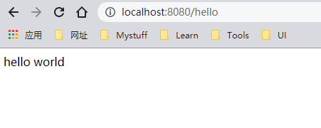

# Hello World

- 通过springboot官方启动器，创建一个springboot项目，引入Web模块。
- 在springboot主启动类同级目录下创建SampleController
```java
// 主启动类
@SpringBootApplication
public class Application {

    public static void main(String[] args) {
        SpringApplication.run(Application.class, args);
    }
}
```

```java
@Controller
public class SampleController {

    @RequestMapping("/hello")
    @ResponseBody
    public String hello(){
        return "hello world";
    }
}
```
- 运行主启动类，浏览器访问http://localhost:8080/hello
 
